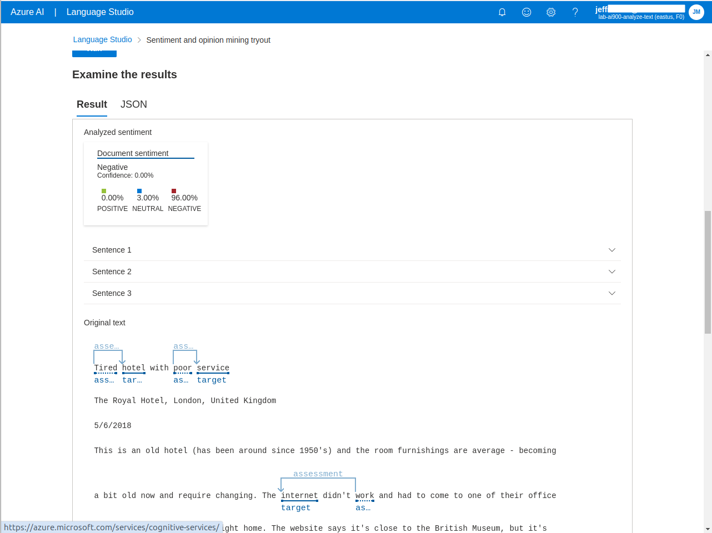
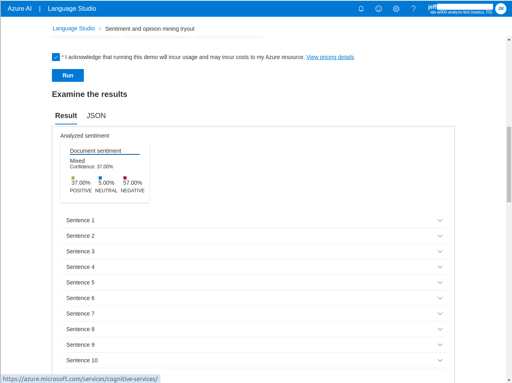
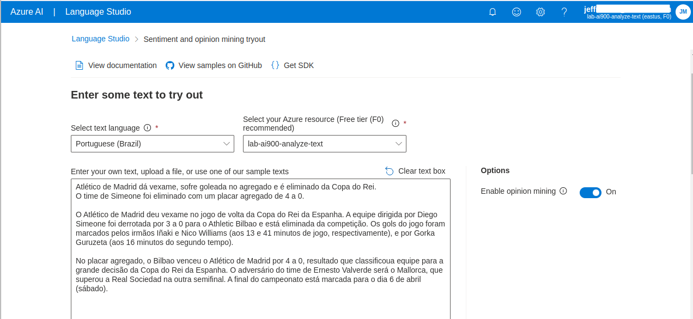

# Azure Natural Language Processing Lab

Neste lab, foram testados os serviços de conversão de fala em texto em 3 idiomas (inglês, português e sueco) e o serviço de análise de sentimento (expressado no texto).

## Conversão do texto em fala

O primeiro teste, foi utilizado o arquivo com a fala disponibilizado no próprio ambiente do [**Speech Studio**](https://speech.microsoft.com/portal).

O resultado da fala convertida em texto pode ser observada na imagem abaixo.

No segundo teste, foi gerada uma fala a partir de um texto utilizando o site [TTSFree.com](https://ttsfree.com/) para o idioma português (Portugal).

O resultado da fala convertida em texto pode ser observada na imagem abaixo. A palavra *speech* foi omitida.

No terceiro e último teste, foi gerada uma fala a partir de um texto no idioma sueco.

Para gerar o texto, foi utilizado o Google Translate para converter o texto de português para sueco:

Em seguida, foi utilizado o mesmo site [TTSFree.com](https://ttsfree.com/) para gerar o arquivo de áudio.

O resultado da fala convertida em texto pode ser observada na imagem abaixo. Desta vez, a palavra *speech* **não** foi omitida.

## Análise de sentimento

Novamente, no primeiro teste, foi utilizado o arquivo com a fala disponibilizado no próprio ambiente do [**Language Studio**](https://language.cognitive.azure.com.).

A seguir podemos observar a análise do texto realizada pelo serviço, categorizando que o texto expressa sentimento classificado como 96% negativo.

Além da análise geral do texto, a plataforma disponibiliza uma análise de cada sentença do texto.

O segundo texto analizado, também disponibilizado pela plataforma, expressa a mesma classificação (negativo), mas com um percentual menor (57%)

No último teste, foi utilizado um texto escolhido aleatóriamente em um site de notícias esportivas.

Na imagem a seguir, podemos verificar a análise feita pela plataforma: 83% Negativo.

Nesta análise podemos verificar um ponto interessante: Embora a frase expresse um sentimento negativo, a análise classificou como "Neutro", com um percentual de apenas 4% para a classificação "Negativo" e 17% para uma classificação "Positivo".

# Conclusão

Neste Lab foram demonstradas duas capacidades da solução de Natural Language Processing da Microsoft Azure: Conversão de fala para texto em tempo real e análise de sentimento.

São soluções poderosas que podem gerar valor para as organizações, e deve ser utilizado com ética e responsabilidade, como é reforçado pela Microsoft na ativação dos recursos.